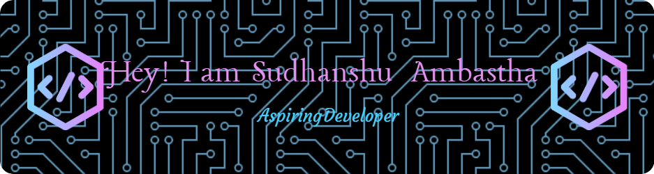

<picture></picture>

I'm a College school student with a passion for learning and coding. I'm constantly exploring new programming languages and expanding my skills. 

### <picture></picture> *Languages and Tools🧰*

 

#

## <picture></picture> *About Me*

- 🎓 I'm a tech savvy, College student.
- 💻 I have a strong interest in programming, and I'm always excited to learn and explore new programming languages and technologies.
- 🧠 I'm passionate about problem-solving and creative thinking.
- 📚 I believe in the power of technological education and self-improvement.

#

<h3 align="left">Stats</h3>

  

<table>
  <tr>
    <td align="center">
      
    </td>
    <td align="center">
      
    </td>
  </tr>
  <tr>
    <td align="center">
      
    </td>
    <td align="center">
      
    </td>
  </tr>
</table>

#

### My Projects

<h4>I'm always working on interesting projects. Stay tuned for updates!</h4>

  

### Contact Me

  

#

### Fun Fact

I believe that coding is like solving puzzles – challenging but incredibly rewarding once you crack it!

Thanks for stopping by! 🚀

  
<b>Visitors Count</b>
  
  
   
  

 
   
  
<!-- counting from 21/04/24 -->

<h1 align="center">Show some 💗 by 🌟 some of the repositories!</h1>

